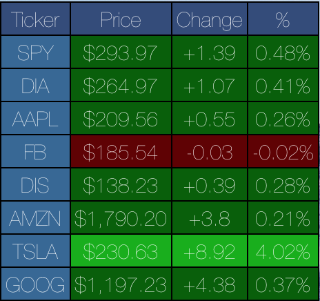

# Stock Tracker Übersicht Widget

## Introduction
---

The plugin displays stock quotes in a table format with color-coding of gains/losses.

This plugin uses the IEX API for data. The use of IEX doesn't allow for Stock Indexes, Currency or non US markets, AFAIK. Adjust left and top in the style section in index.coffee if you want the plugin placed somewhere else on the screen. 

1. This plugin will allow you to view the prices, and daily changes to the selected stocks in your list.
2. The list of stocks is configurable
3. This plugin is modified based on the [stock-widget](http://tracesof.net/uebersicht-widgets/#stock-widget) plugin.
4. The use of this plugin requires the installation of [Ubersicht](http://tracesof.net/uebersicht/) software.

Installation method
-------
1. Open the Ubersicht Widget folder.
2. `git clone` this repository and move the code to the above folder.
3. Get your own free API key from [IEX](https://iexcloud.io/cloud-login?r=https%3A%2F%2Fiexcloud.io%2Fconsole#/register)
4. Edit gatherData.py inserting your sk into KEY and editing the list of stocks you want to track
